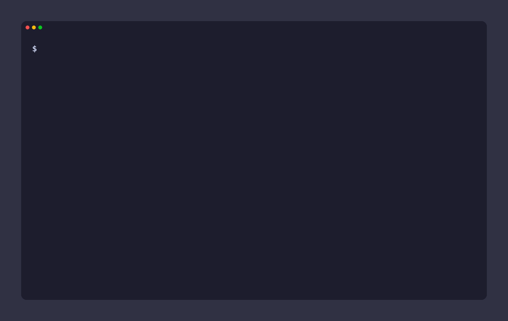

# Verbatim Commit

> *An honest commit of your changes.*

A local-first CLI for commit messages, with two modes:

1. **Generate** (`verbatim gen`) — reads your staged diff, generates a commit message with a local LLM (Gemma via [Ollama](https://ollama.com)), and commits on confirmation.
2. **Verify** (a `commit-msg` git hook) — checks any commit message (typed or generated) for low-effort phrasing and prompts before letting it land.

<p align="center">
  
</p>

**Local-first and private by default.** Your code, diffs, and commit messages never leave your machine — everything runs against a local Ollama model. No cloud API, no account, no telemetry. Unlike most AI commit tools, your private codebase is never sent to a third-party service.

---

## Local-first & private

This is the core design choice, not an afterthought:

- **Your data stays yours.** Diffs and messages are sent only to your local Ollama instance (`localhost` by default). Nothing is uploaded, logged remotely, or shared.
- **No accounts, keys, or telemetry.** There's nothing to sign up for and nothing phoning home.
- **Works offline.** Once the model is pulled, generation and verification need no network.
- **You stay in control.** The only way data leaves your machine is if *you* point `ollamaHost` at a remote server — the default keeps everything local.

For private or proprietary codebases where sending diffs to a hosted LLM is a non-starter, this runs entirely on your own hardware.

---

## Requirements

- **Git**
- **Node.js ≥ 18**
- **[Ollama](https://ollama.com)** running locally, with a model pulled:
  ```sh
  ollama pull gemma3:4b
  ```
  The model is configurable; `gemma3:4b` is the default.

## Install

```sh
git clone https://github.com/JonathanSContreras/verbatim-commit.git && cd verbatim-commit
./scripts/install.sh        # npm install + build + npm link
```

This puts `verbatim` on your `PATH`. Then, in any repo where you want the commit-msg check:

```sh
verbatim install-hook
```

<details>
<summary>Manual install (without the script)</summary>

```sh
npm install
npm run build
npm link
```
</details>

## Usage

### Generate a commit message

```sh
git add .
verbatim gen
```

You'll see a candidate message and a prompt:

```
Generated commit message:

  Add retry logic to the payment client

Use this message? [y]es / [e]dit / [r]egenerate / [q]uit:
```

- **y** — commit it
- **e** — open the message in your `$EDITOR`, then commit
- **r** — generate a different candidate
- **q** — abort without committing

It never commits without your confirmation. If the candidate looks weak, you'll see a `! Looks weak: …` note alongside the prompt.

### Verify mode (the hook)

Once `verbatim install-hook` is run, every `git commit` in that repo is checked. Good messages pass silently. A weak one prompts:

```
! This commit message looks weak: "wip"
   - matches low-effort phrase: "wip"
   - subject is only 1 word (minimum 3)

Commit anyway? (y/N)
```

- **y** — commit proceeds
- **n** / **Enter** — commit is aborted; fix the message and try again
- **No terminal** (CI, GUI git clients, scripts) — no prompt, commit always proceeds

This is a soft nudge, not a hard gate.

## Commands

| Command | What it does |
| --- | --- |
| `verbatim gen` | Generate a commit message from staged changes and commit on confirmation |
| `verbatim verify <file>` | Check a message file (used by the hook; you won't normally call this) |
| `verbatim install-hook [--force]` | Install the `commit-msg` hook in the current repo (`--force` to overwrite a foreign hook) |
| `verbatim uninstall-hook` | Remove the hook (only if it's ours) |

## How it works

- **Staged diff only.** Generation and the LLM verify pass use `git diff --cached` — exactly what's about to be committed.
- **Diff budgeting.** The diff is sized to a fraction of the model's context window (lockfiles, binaries, and vendored paths are stripped first). Small diffs are sent in full; large ones are summarized per file with explicit `[N lines omitted]` markers. A complete file-change inventory (added/deleted/renamed) is always included, so even filtered-out binary changes are never invisible to the model.
- **Repo-aware context.** The branch name and the last few commit subjects are included so output matches your repo's tone.
- **Two checks.** A fast rule-based pass (word count, low-effort phrases, identical-to-previous) runs always; an optional LLM second-pass ("does this message actually describe the change?") runs only if you enable it.

## Configuration

Config is merged from three sources, each overriding the last:

1. Built-in defaults
2. **Global:** `~/.verbatim/config.json` (override the dir with `VERBATIM_HOME`)
3. **Per-repo:** `.verbatimrc` at the repo root (found by walking up from the current directory)

Per-repo wins — e.g. relaxed side projects, conventional/strict work repos. Nested objects (like `contextWindow`) are merged; arrays (like `blocklist`) are replaced.

| Key | Default | Meaning |
| --- | --- | --- |
| `model` | `"gemma3:4b"` | Ollama model name |
| `ollamaHost` | `"http://localhost:11434"` | Ollama base URL |
| `contextWindow` | `{ "gemma3:4b": 128000 }` | Per-model context window (tokens) |
| `diffBudgetFraction` | `0.5` | Fraction of the context window reserved for diff content |
| `messageFormat` | `"plain"` | `"plain"` or `"conventional"` (feat:/fix:/…) |
| `minWordCount` | `3` | Subjects with fewer words are flagged |
| `blocklist` | see `src/config.ts` | Low-effort phrases that flag a message |
| `hookEnabled` | `true` | Master switch for the commit-msg hook |
| `llmVerifyEnabled` | `false` | Enable the LLM second-pass in verify mode |

Example `.verbatimrc` for a work repo:

```json
{
  "messageFormat": "conventional",
  "minWordCount": 4,
  "llmVerifyEnabled": true
}
```

## Choosing a model

Any model available in Ollama works — set `model` to whatever you prefer (`qwen2.5-coder`, `llama3.1`, a larger Gemma, etc.):

```json
{
  "model": "qwen2.5-coder:7b",
  "contextWindow": { "qwen2.5-coder:7b": 32768 }
}
```

The default is **`gemma3:4b`** because it hits the sweet spot for a tool that runs on every commit:

- **Runs anywhere.** ~3.3 GB and no GPU required — it's comfortable on a typical laptop.
- **Fast.** Generation takes a few seconds, so it never becomes friction in your commit flow.
- **Big context.** A 128K-token window comfortably fits large diffs (see [diff budgeting](#how-it-works)).
- **Good quality for its size.** Summarizing a diff into a one-line subject is well within a small model's reach, so a 4B model gets you most of the value without the cost of a large one.

Step up to a larger model if you want richer messages and can spare the RAM and latency. **When you switch, add a matching `contextWindow` entry** — diff budgeting uses it to size the diff, and falls back to a conservative 8192 tokens for unknown models.

## Troubleshooting

**`verbatim: command not found`**
The command isn't on your PATH. Run `./scripts/install.sh` (or `npm link`) from the project directory, and make sure your npm global bin is on your PATH.

**`Ollama not reachable at http://localhost:11434`**
Ollama isn't running. Start it (`ollama serve`, or launch the Ollama app) and retry.

**`Model "gemma3:4b" not found`**
Pull it: `ollama pull gemma3:4b` — or set a different `model` in your config (see [Choosing a model](#choosing-a-model)).

**`No staged changes`**
`gen` only looks at staged changes — stage something first with `git add`.

**The hook isn't catching anything.** Check, in order:
- Is it installed in this repo? Run `verbatim install-hook`.
- Did you commit with `git commit --no-verify`? That bypasses all hooks.
- Is `hookEnabled` set to `false` in your config?
- Did `install-hook` refuse because another `commit-msg` hook already exists? Re-run with `--force` (back up the other hook first).

**The hook never prompts, it just commits.**
Expected when there's no controlling terminal — GUI git clients, some IDEs, and CI don't get the prompt, so the commit proceeds (the tool never blocks automation). Commit from a terminal if you want the interactive prompt.

**Generated messages are low quality.**
Quality depends on the model. Press `r` to regenerate, or switch to a larger model (see [Choosing a model](#choosing-a-model)).

**The hook broke after switching Node versions (nvm).**
`install-hook` bakes the absolute path to your Node at install time. If that Node is gone, just re-run `verbatim install-hook`.

**Config changes aren't taking effect.**
Invalid JSON is ignored (with a warning). Confirm the file parses, that it's in the right place (`~/.verbatim/config.json` globally or `.verbatimrc` at the repo root), and remember per-repo overrides global.

## Cross-platform

Works on macOS, Linux, and Windows. The interactive hook prompt reads the terminal directly (`/dev/tty` on POSIX, `CONIN$`/`CONOUT$` on Windows) since git owns stdin during a hook. The hook shim is LF-ended and runs via Git for Windows' bundled bash. (Windows is supported by design; primary testing has been on macOS.)

## Development

```sh
npm run build      # compile TypeScript to dist/
npm run dev        # watch mode
npm test           # build + run the test suite
```

Built with AI assistance (Claude). Design decisions, testing, and direction are my own.

## Limitations

- **Message quality scales with the model.** Output is only as good as the local model you run — `gemma3:4b` is a solid default, but smaller models give rougher messages. Step up to a larger model for richer output (see [Choosing a model](#choosing-a-model)).
- **Windows is supported by design but not yet tested** on real hardware — development and testing have been on macOS.

## Not in v1

- Parsing `CONTRIBUTING.md` for commit conventions
- Diff-quality checks (missing tests, debug logs, oversized diffs)
- Team-wide commit-style learning
- Logging flagged-but-overridden commits

See `docs/git-commit-tool-plan.md` for the full design.

## Feedback

This is a personal project and feedback is very welcome — especially on the prompts and the heuristic rules. Open an [issue](https://github.com/JonathanSContreras/verbatim-commit/issues) or start a discussion.
